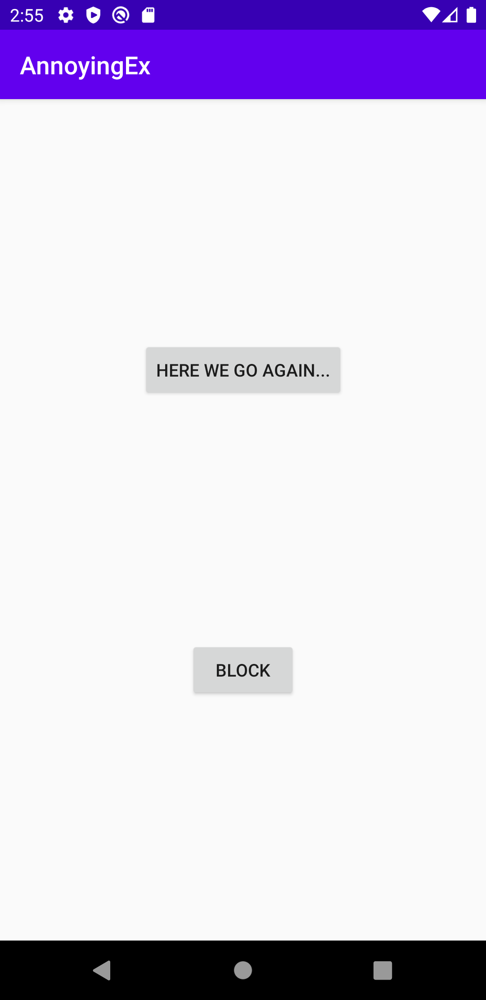
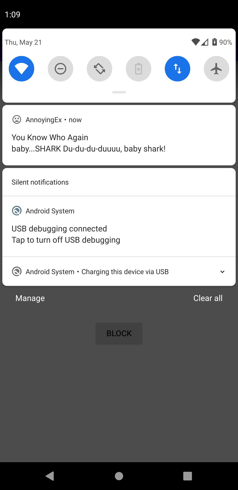
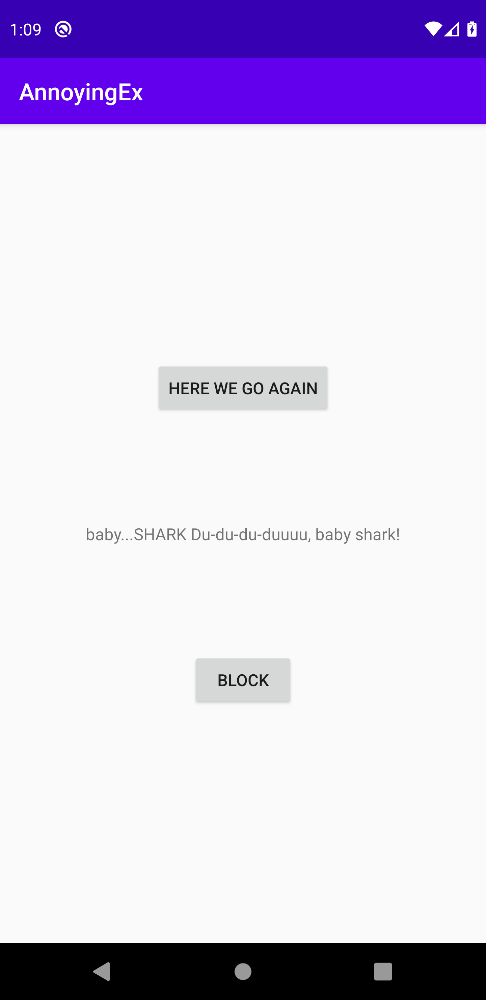

# Dotify - Homework 5
## Background Tasks & Notifications
Author: Diana Dai

Date: 5/21/2020

## App Description
AnnoyingEx is an app that is used to have annoying fictional ex-partner who will send meaningless message and get pushed to the notification once a while. Some messages include “hey you up?, “wyd”, “I miss you”, “can we talk”, “i still love you”, “plz unblock me”, “Netflix n chill?”, etc. Users have the ability to block the fictional ex-partner as well.

## Extra Credits Attempted
1. In requirement 3.a.v.2., when a user launches the MainActivity from the notification, it should display
the text that was in the message/notification somewhere in the activity. (+1)
2. Create another separate worker that runs every 2 days that fetches JSON only when the device’s
battery is not too low and is connected to a network. (+.25)


## Screenshots (emulator)
Default Screen


Notification


Show the message when clicked


## Special set up/installation instructions or how to use the app
In the ```AnnoyingExManger.kt```, I have commented line 22 which is setting the constraints for the push notification worker.

 ```//Todo: remove the commented line ".setConstraints(constraints)"```

I have to commented it out because my OS level would not work even if I have already set the phone to be in a charging state. Please remove the comment if users' OS level work with this feature.
